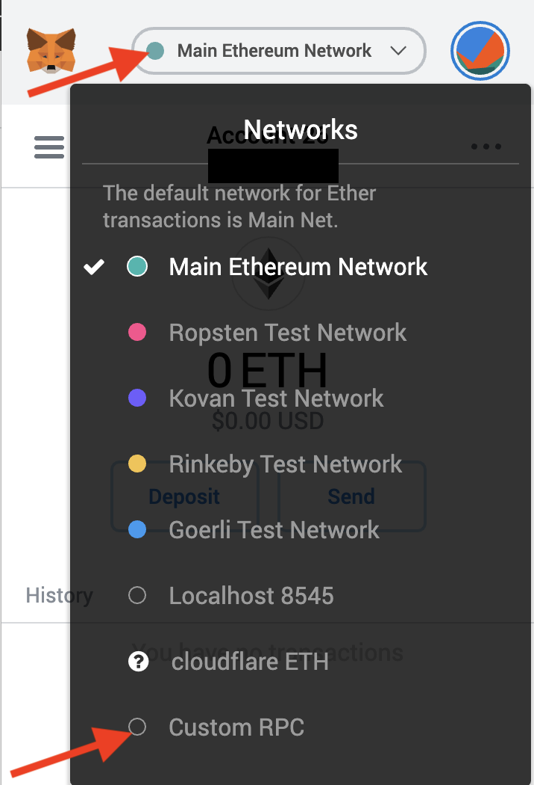
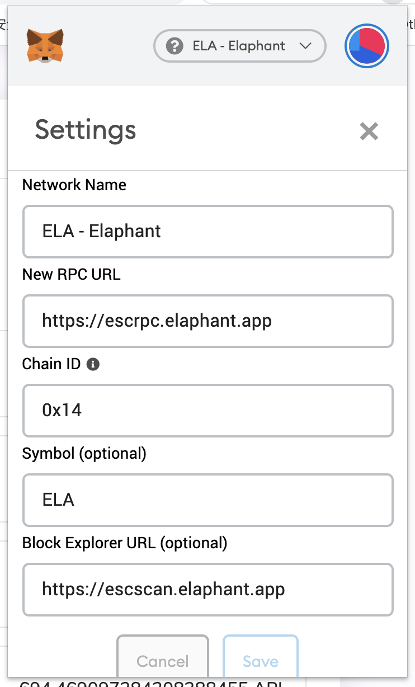
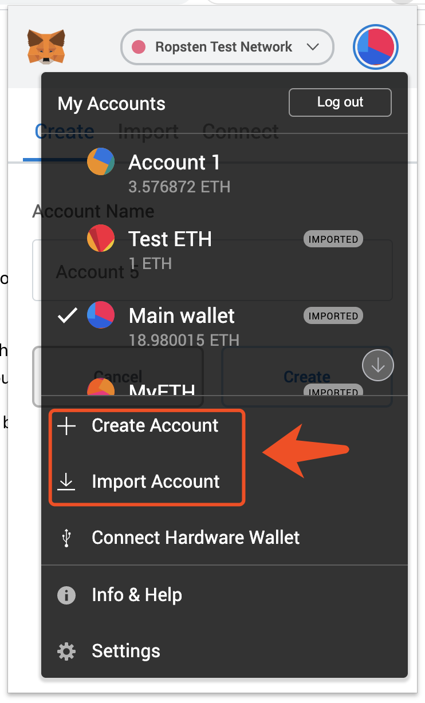
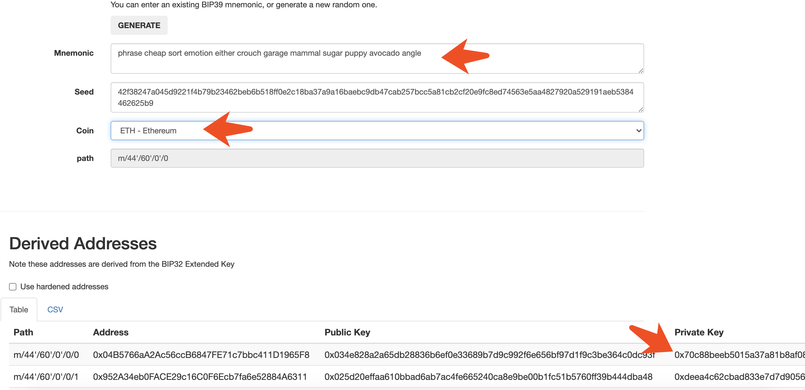

# MetaMask Guide

### 1. Install MetaMask

You must have installed the Chrome, Firefox or Brave browser.

Use the URL below to download & install the Metamask Wallet.

<https://metamask.io/>


### 2. Connect to the Elastos sidechain




Above is the network setting.


### 3. Create a wallet or import a wallet



If you want to import your elephant wallet to MetaMask, you will first need your private key. You can open <https://elaphant.app/mnemonic.html> and enter your mnemonics, the page will generate your private key in the below table.



Please copy that private key to MetaMask. Note, please double check the address after imptorted.


### 4. To recharge MetaMask

You can directly transfer ELA/ETHSC to your MetaMask address. If you have no ELA/ETHSC, you can use the below URL to convert ELA into your MetaMask wallet.

```
https://transfer.elaphant.app/?dstaddress=[Your_MetaMask_Address]
```


### 5. Enjoy!

Congratulation, you are ready for getting a CryptoName. 

You can find your name in the [Register](https://cryptoname.org/register.html)

You can manage your names in the [Account](https://cryptoname.org/account.html)

You can also set your name in there.

Enjoy it.