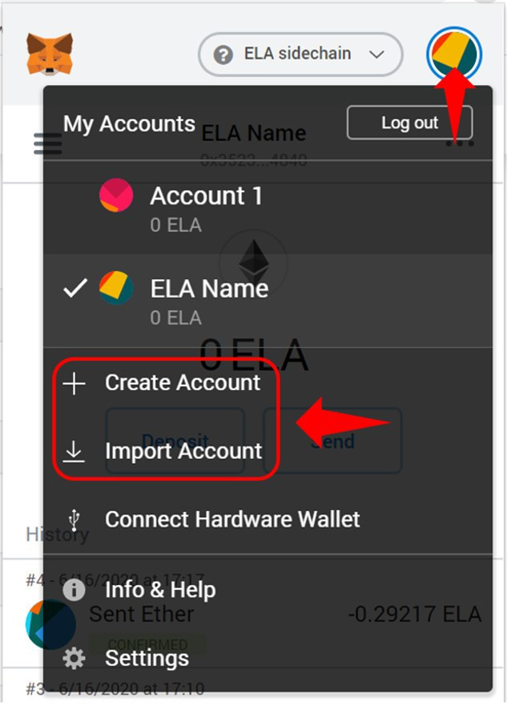

# MetaMask Guide

### 1. Install MetaMask and Elaphant wallet app.

First you need a PC/ Laptop with Chrome, Firefox or Brave browser installed. Then download and install Metamask Wallet from here –

https://metamask.io

Secondly you need an android / IOS device with Elaphant wallet installed, download here –

https://elephantwallet.app/


### 2. Connect to the Elastos sidechain.


Network Name: 

```
ELA sidechain
```

Symbol: 

```
ELA
```

New RPC URL: 

```
https://mainrpc.elaeth.io
```

Block Explorer URL: 

```
https://explorer.elaeth.io
```

Above is the network setting.


### 3. Create a wallet or import a wallet.



If you want to import your Elaphant wallet to MetaMask, you will first need your private key. Click this link https://elaphant.app/mnemonic.html and enter your Elaphant wallet mnemonics, the page will then generate your private key below.


Please copy that private key to MetaMask. Note, please double check the address after imptorted.


### 4. Send ELA to your CryptoName Metatamask account.

You are now connected to the Elastos sidechain through Metamask, the next step is to send ELA from your Elaphant wallet to your CryptoName account.

Go to your CryptoName Account on the PC/Laptop and press Deposit, a QR code will appear on the screen.

Now using the Elephant wallet on your device click send and scan the QR code, enter the amount of ELA and click Send.

After a few minutes the ELA should appear in you CryptoName Account.

Set up complete.

You are now ready to purchase your CryptoName's.

You can now search and purchase your names in the [**Register**](https://cryptoname.org/register.html).

You can manage your names in the [**Account**](https://cryptoname.org/account.html).

Enjoy !

### 5. How to return ELA from your CryptoName Account back to your Elephant wallet.

On the CryptoName Account page on the PC/Laptop click Withdraw. Enter the amount of ELA and the address of the Elephant wallet, and click send.

After a few minutes minutes the ELA will appear in the Elephant wallet on the device.