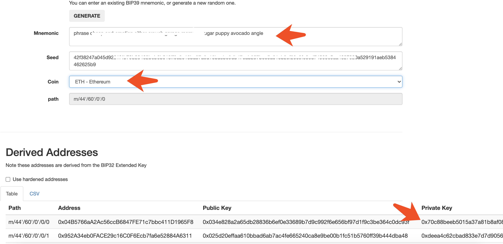

# How to use CryptoName

<iframe width="560" height="315" src="https://www.youtube.com/embed/MmJpE7xJlBI" frameborder="0" allow="accelerometer; autoplay; encrypted-media; gyroscope; picture-in-picture" allowfullscreen></iframe>


### 1. Install MetaMask and Elaphant wallet app.

First you need a PC/ Laptop with Chrome, Firefox or Brave browser installed. Then download and install Metamask Wallet from here –

https://metamask.io

Secondly you need an android / IOS device with Elaphant wallet installed, download here –

https://elaphant.app/


### 2. Connect to the Elastos sidechain.


There are two public node can be used.

Network Name: 

```
ELA sidechain
```

Symbol: 

```
ELA
```

ChainID: 

```
0x14
```
New RPC URL: 

```
https://escrpc.elaphant.app
```

or

```
https://mainrpc.elaeth.io
```

Block Explorer URL: 

```
https://escscan.elaphant.app
```

or

```
https://explorer.elaeth.io
```

Above is the network setting.


### 3. Create a wallet or import a wallet.


If you want to import your Elaphant wallet to MetaMask, you will first need your private key. Click this link https://elaphant.app/mnemonic.html and enter your Elaphant wallet mnemonics, the page will then generate your private key below.



Please copy that private key to MetaMask. Note, please double check the address after imptorted.


### 4. Send ELA to your CryptoName Metamask account.

You are now connected to the Elastos sidechain through Metamask, the next step is to send ELA from your Elaphant wallet to your CryptoName Account.

Go to your CryptoName [**Account**](https://cryptoname.org/account.html) on the PC/Laptop and press **Deposit**, a QR code will appear on the screen.


Now using the Elaphant wallet on your device click send and scan the QR code, enter the amount of ELA and click Send.

After a few minutes the ELA should appear in you CryptoName Account.

Set up complete.

You are now ready to purchase your CryptoName's.

You can now search and purchase your names in the [**Register**](https://cryptoname.org/register.html).

You can manage your names in the [**Account**](https://cryptoname.org/account.html).


### 5. How to return ELA from your CryptoName Account back to your Elephant wallet.

On the CryptoName [**Account**](https://cryptoname.org/account.html) page on the PC/Laptop click Withdraw. Enter the amount of ELA and the address of the Elephant wallet, and click send.

After a few minutes minutes the ELA will appear in the Elaphant wallet on the device.


### 6. How to Purchase/Register your CryptoName.

On the CryptoName website on your PC/Laptop click the [**Register**](https://cryptoname.org/register.html) link. Then enter your chosen name in the registration bar, if the name is available you will see a green tick and the estimated price below.

To proceed click the Register button below the price, the Metamask wallet will now pop up, you now need to click Confirm within the Metamask wallet. Wait a few minutes and your CryptoName will appear within the Account page.

To link your CryptoName to your Elaphant wallet, go to the Account page and click Edit on your chosen name. At the bottom of the page click "Start Elaphant to fill in quickly" .

A QR code will now appear on the screen, using the Elaphant Wallet on the device, scan the QR code( see images for the location of the Qr scanner within the Elaphant wallet)


Once this process is complete click the Save button within the edit page on your PC/Laptop. And that's it, people will now only need to enter your CryptoName to send you ELA, ETH, BTC.


### 7. How to transfer your CryptoName.

Within the CryptoName [**Account**](https://cryptoname.org/account.html) page on the PC/Laptop click Transfer on the CryptoName you want to transfer. You will now need to enter the receivers Account Address (this can be found in their CryptoName Account page), then click Submit.

The Metamask wallet will now pop up, click Confirm. Wait a while and it will appear in the receivers CryptoName Account page.

Please note, you can only transfer your CryptoName, to another registered CryptoName account.


